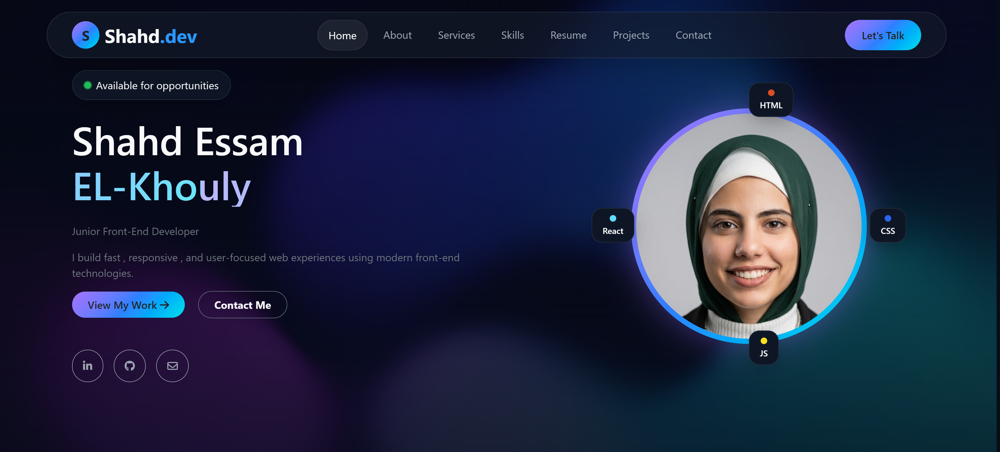

# Shahd Essam - Portfolio Website

A modern and responsive personal portfolio website built to showcase my skills, projects, experience, and front-end development journey.

## 🚀 Live Demo

https://shahdessam2004.github.io/CodeAlpha_Portfolio/

## ✨ Features

- Responsive design for all screen sizes
- Modern and clean user interface
- Smooth scrolling navigation
- Interactive sections
- Skills and technologies showcase
- Projects showcase
- Contact section
- Hover effects and animations
- Mobile-friendly layout

## 🛠️ Technologies Used

- HTML5
- CSS3
- JavaScript
- Bootstrap 5
- Font Awesome

## 📂 Website Sections

- Home
- About Me
- Skills
- Services
- Projects
- Contact

## 🎯 Project Purpose

This portfolio website was developed to present my front-end development skills, highlight my projects, and provide an overview of my experience and learning journey.

## 📸 Preview

## 👩‍💻 Author

**Shahd Essam**

- GitHub: https://github.com/Shahdessam2004
- LinkedIn: https://www.linkedin.com/in/shahdessam/
